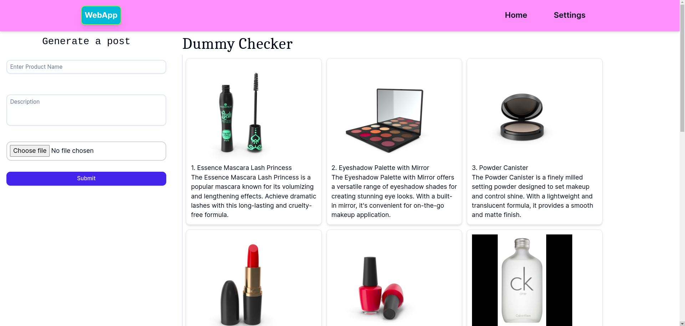
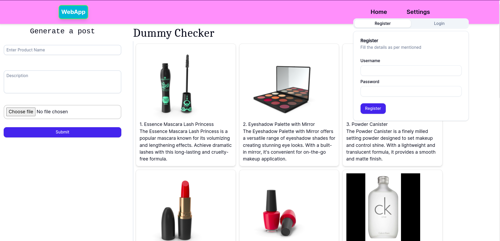
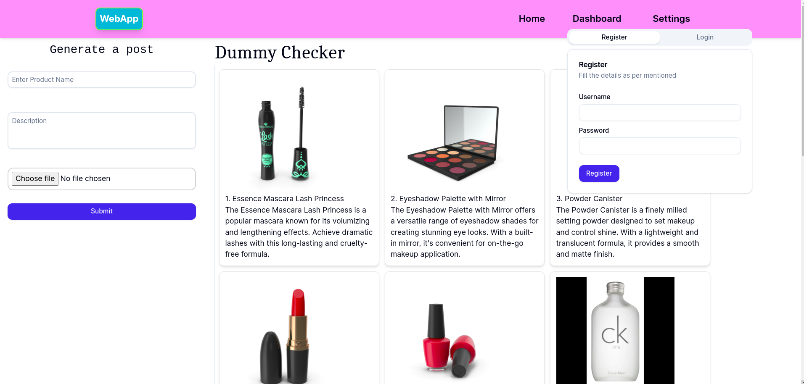
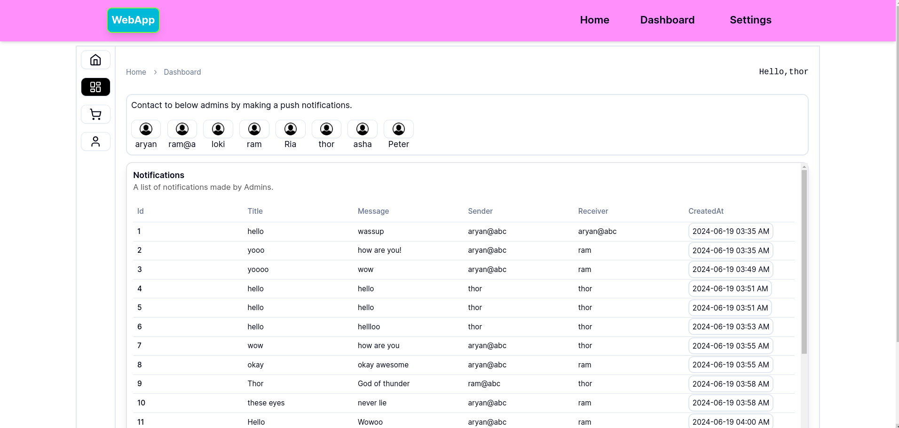
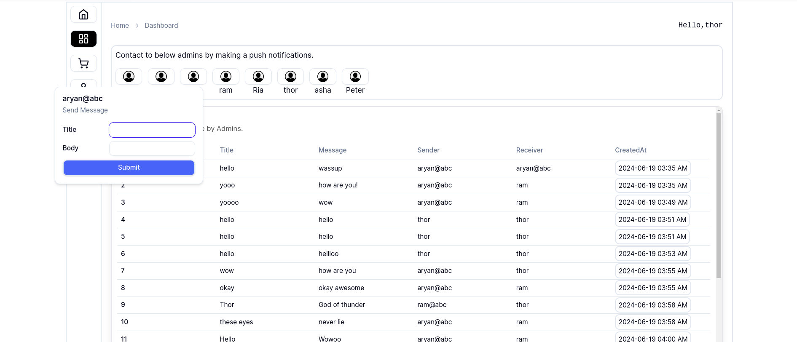

<h3>Website is live and running at  <a href="https://pwa-fullstack-ytx.onrender.com/">PWA WebApp</a>
</h3>

<h2>Authors</h2>
<ul>
<li><a href="https://github.com/A-ryan-Kalra">Aryan Kalra</a></li>
</ul>
 

<h1>Features</h1>

> [!NOTE]
>
> <ul>
> <li>Admin Dashboard is only accessible to authorized users.However, User has to register an account in order to create a listing of their property.</li>
> <li>The project also includes a PWA extension, allowing you to easily access this website on your phone and have the same experience as when using the regular app.</li>
> <li>Feel free to visit.</li>

</ul>

<h1>Landing Page</h1>

 
<h1>Registration</h1>
<ul>
<li>You need to register your account first</li>
</ul>

 
<h1>Dashboard Visibility</h1>
<ul>
<li>Once you are registered you will see the dashboard access.</li>
</ul>

 
<h1>Admin Dashboard</h1>
<ul>
<li>Now you can connect to below registered users by making a push notifications.</li>
</ul>

 
<h1>Permission</h1>
<ul>
<li>It requires permission to make users subsribed to notifications.</li>
</ul>

 

<h1>Push Notifications</h1>
<ul>
<li>Once the permission is granted, you can now send the notifications to registered users.</li>
</ul>

Thank you\
By Aryan Kalra

